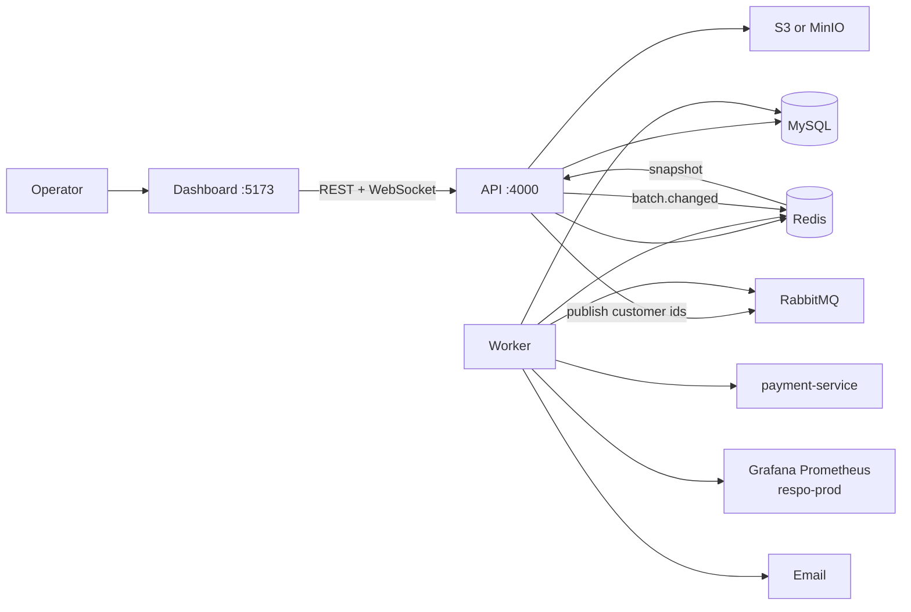
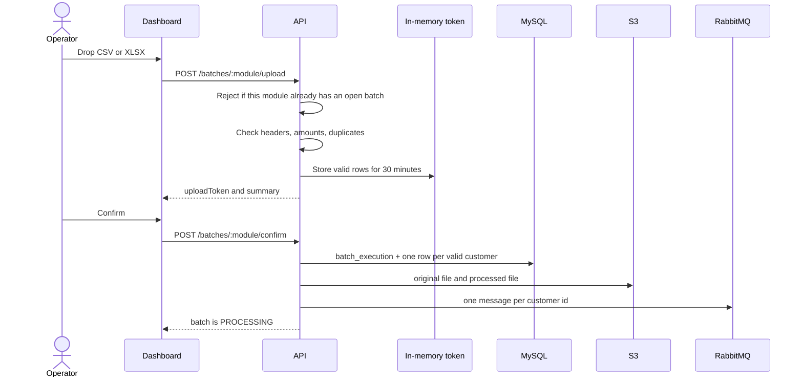
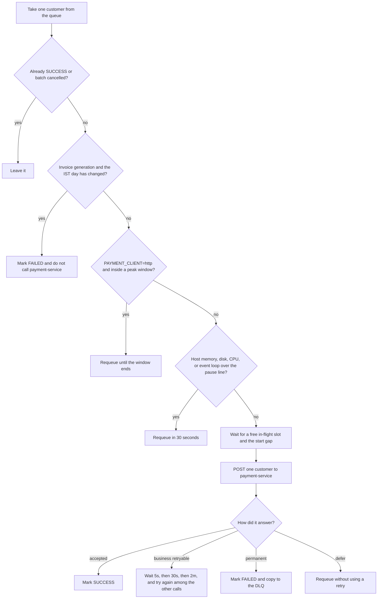
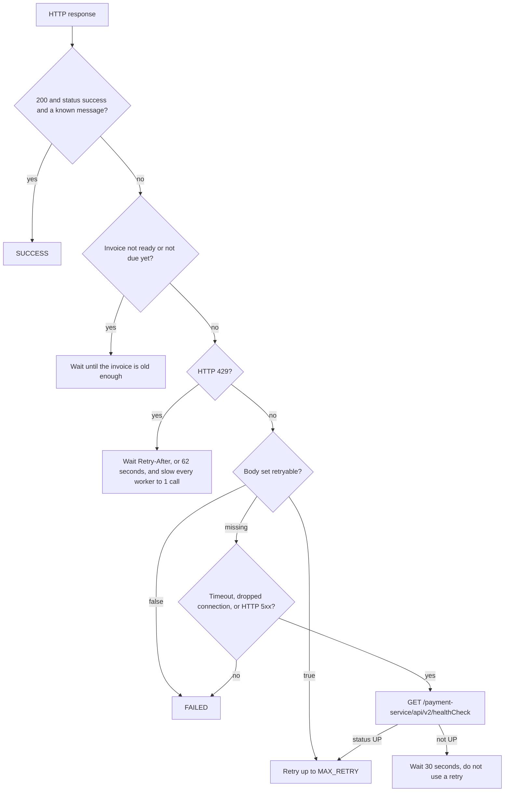
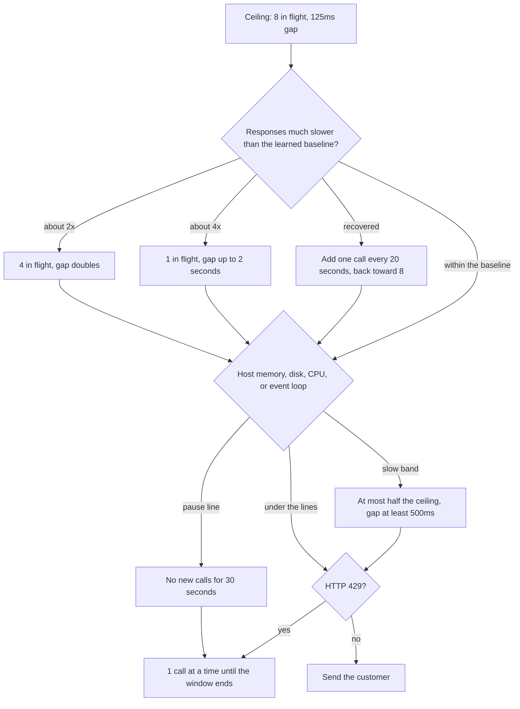
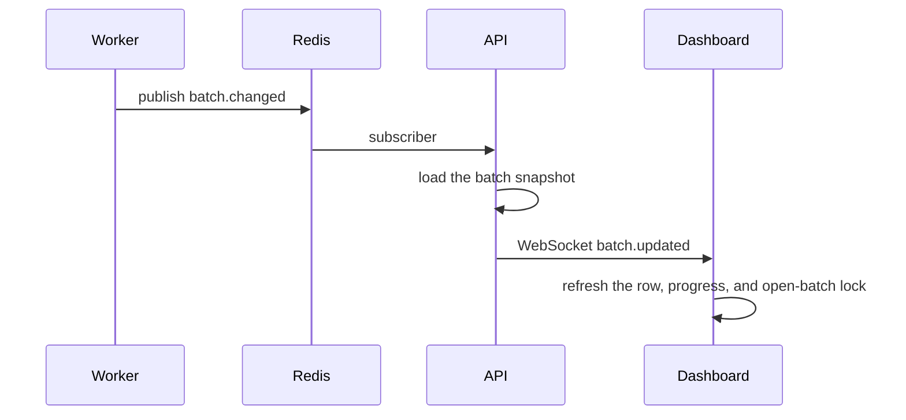
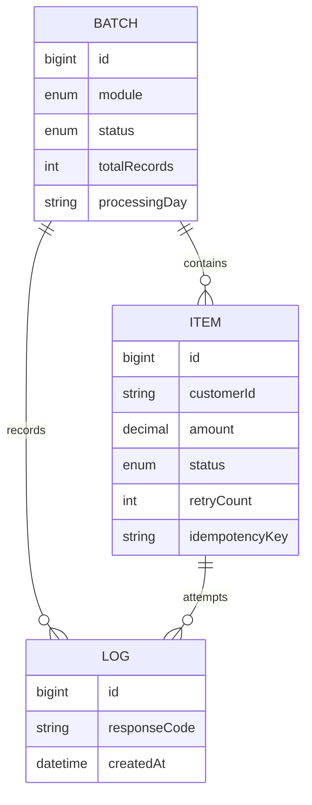

# UPI Batch Processing Platform

Runs large UPI autopay batches. An operator uploads a file of customers, confirms it, and a worker calls payment-service once per customer. The dashboard follows the batch live.

Two modules run independently:

| Module | What the worker calls |
| --- | --- |
| Invoice Generation | `POST /payment-service/api/v2/upi/autopay/invoice` |
| Invoice Charge | `POST /payment-service/api/v2/upi/autopay/charge` |

Each request body is one customer: `{ "customerId": 10188945, "amount": 7068 }`. Both calls send header `x-api-key`, the same value as payment-service `X_API_KEY`.

## Layout

```
E-Nach/
  backend/          Fastify API and the RabbitMQ worker
  frontend/         React dashboard
  docker-compose.yml
  samples/          Example CSV files
```

The API and the worker are two processes. The API accepts uploads and serves the dashboard. The worker is the only process that calls payment-service.

## How the pieces connect



| Piece | Role |
| --- | --- |
| MySQL | Batches, customers, and attempt logs |
| Redis | One-batch lock, call pace, host-pressure sample, progress-email claim, live-update channel |
| RabbitMQ | One message per customer. Delay queues hold a customer until a pause ends |
| S3 / MinIO | Original file, valid rows, and downloadable reports |
| payment-service | Invoice and charge for one customer, plus `/healthCheck` and `/metrics` |
| Grafana Prometheus | System memory, disk, and CPU for host `respo-prod` |

## Run it locally

```bash
docker compose up -d

cd backend
cp .env.example .env
npm install
npx prisma migrate deploy
npm run dev            # API  http://localhost:4000
npm run dev:worker     # payment calls

cd ../frontend
cp .env.example .env
npm install
npm run dev            # dashboard  http://localhost:5173
```

Step-by-step start and recovery: [STARTUP.md](STARTUP.md).

| Surface | URL |
| --- | --- |
| Dashboard | http://localhost:5173 |
| API docs | http://localhost:4000/docs |
| RabbitMQ | http://localhost:15673 (`batch` / `batch`) |
| MinIO | http://localhost:9001 (`minioadmin` / `minioadmin`) |

Sample file: [`samples/customers.csv`](samples/customers.csv). Headers are `customer_id` and `final_nach_amount`. Casing and spaces do not matter. Extra columns are ignored.

Dev login: `admin@zype.local` / `password`.

| User | Can |
| --- | --- |
| `admin@zype.local` | View, upload, retry |
| `uploader@zype.local` | View, upload |
| `viewer@zype.local` | View |

`POST /api/v1/auth/login` returns a JWT. The dashboard sends it on every API call and on the socket.

## One file at a time

Each module allows one open batch. Open means `UPLOADED`, `VALIDATING`, `READY`, `QUEUED`, or `PROCESSING`.

A second upload for that module returns HTTP 409 before the file is read. The drop zone on the dashboard stays disabled while `openBatch` is set. The Redis lock (`lock:batch:invoice-generation` or `lock:batch:invoice-charge`) is the second guard, held for 26 hours and refreshed while customers are processed. It is released when the batch reaches `COMPLETED`, `PARTIAL_SUCCESS`, `FAILED`, or `CANCELLED`.

Invoice Generation and Invoice Charge can run at the same time. They do not block each other.

## Upload and confirm



The upload token lives in the API process. If the API restarts before confirm, upload the file again. Nothing is in MySQL until confirm.

Batch status after confirm moves `UPLOADED` → `VALIDATING` → `READY` → `QUEUED` → `PROCESSING`, then one of:

| Final status | Meaning |
| --- | --- |
| `COMPLETED` | Every customer accepted |
| `PARTIAL_SUCCESS` | Some accepted, some failed |
| `FAILED` | None accepted |
| `CANCELLED` | Operator cancelled. Customers still waiting are failed with "Batch cancelled" |

Customer status is `PENDING`, `PROCESSING`, `RETRYING`, `SUCCESS`, or `FAILED`.

Idempotency key is `batchId_customerId`. A customer already `SUCCESS` is never called again.

Confirm publishes customer ids in pages of 1,000. MySQL inserts use `BATCH_SIZE` (default 500).

## What the worker does with one customer



`PAYMENT_CLIENT=mock` uses a local stub. It does not call payment-service, and it does not apply the in-flight cap, the gap, peak hours, or host pressure.

`PAYMENT_CLIENT=http` is the production path. Restart the worker after changing `.env`.

Invoice generation is tied to the IST day stored when the file was confirmed (`processingDay`). If that customer is still on the queue after midnight, or inside the last 5 minutes of that day, the worker marks it failed and does not call payment-service. Customers already accepted stay accepted. Invoice charge is not limited to that day. Set `INVOICE_SAME_DAY_GUARD=false` to allow a leftover invoice message the next day.

A deferred customer stays `PENDING`, or `RETRYING` if it has already failed once. The message sits on a RabbitMQ delay queue and, when the wait ends, returns to `{queue}-retry`. That queue is consumed while the main file is still running, so a 5 second or 2 minute retry is not stuck behind every remaining customer. The payment in-flight cap still limits how many calls are open. The worker must be running when the wait ends. If it is stopped, the message waits on the queue and runs when the worker returns, after a fresh check of the clock and the host.

`CANNOT_CREATE_AUTOPAY_INVOICE` with `invoiceStatus: REJECTED` is still retried. After the retries are used, the failure reason is `INVOICE REJECTED`. Charge failures keep the payment-service reason and also store the invoice id, order id, and related fields on `failed.csv`.

## How a payment-service answer is treated



Success messages:

- `AUTOPAY_INVOICE_CREATED_SUCCESSFULLY`
- `AUTOPAY_INVOICE_ALREADY_CREATED` (an unpaid invoice already exists)
- `AUTOPAY_CHARGE_CREATED_SUCCESSFULLY`

Counted retries (`MAX_RETRY` default 3, delays 5s, 30s, 2m):

- `CANNOT_CREATE_AUTOPAY_INVOICE`
- `CANNOT_CHARGE_SUBSCRIPTION_PLAN`
- a throw inside payment-service
- timeout, dropped connection, or HTTP 5xx while health check is `UP`

Failed once, no retry:

- `INVALID_REQUEST_FORMAT`, `CUSTOMER_ID_NOT_PROVIDED`, `INVALID_CUSTOMER_ID`, `PAYMENT_AMOUNT_NOT_PROVIDED`
- `NO_ACTIVE_AUTOPAY_SUBSCRIPTION_FOUND`
- `NO_UNPAID_INVOICES_FOUND_TO_CHARGE`
- a bare HTTP 400 with no `retryable` flag

Waits that do not use a retry:

| Reason | Wait |
| --- | --- |
| Peak hours | Until the IST window ends |
| Host pressure pause | 30 seconds, then check again |
| Health check not `UP` | 30 seconds. One health result is shared for 5 seconds |
| HTTP 429 rate limit | `Retry-After`, or 62 seconds. Payment-service allows 25,000 requests per IP per minute |
| Invoice too young to charge | `(minimumChargeHours - invoiceAndChargeDiffHours)` hours plus 5 minutes, from the response |
| Invoice not due yet | Until 00:00 IST on `scheduledOn`, capped at 48 hours, then checked again |
| Call slot still busy after `PAYMENT_SLOT_WAIT_MS` | 5 seconds |

A failed customer is also copied onto `invoice-generation-dlq` or `invoice-charge-dlq`. **Retry failed** and **Retry DLQ** put those customers back on the main queue. Both require the module to be idle, then take the lock again.

`API_TIMEOUT` is 120 seconds because each UPI call waits for the gateway.

Full response matrix: [backend/docs/payment-integration.md](backend/docs/payment-integration.md).

## How fast the calls go

The ceiling matches the load payment-service already accepts from data-pipeline: **8 calls in flight**, **125ms between starts**.



Calls per second are the smaller of `1000 / gap` and `in flight / seconds per call`. At a 2 second gateway call the steady rate is about 4 per second. A 50,000 customer file is about 3.5 hours of calling time, and 1 lakh is about 7 hours, plus peak-hour pauses.

| Order | Variable | Default | Effect |
| --- | --- | --- | --- |
| 1 | `QUEUE_CONSUMERS` | 2 | Listeners on each queue. This does not multiply HTTP calls |
| 2 | `QUEUE_CONCURRENCY` | 12 | Customers this worker may hold. Keep it a little above the in-flight cap |
| 3 | `PAYMENT_MAX_IN_FLIGHT` | 8 | Most calls that may wait on payment-service at once |
| 4 | `PAYMENT_REQUEST_GAP_MS` | 125 | Minimum pause between call starts |

`PAYMENT_ADAPTIVE=true` shares that pace across workers through Redis. `PAYMENT_ADAPTIVE=false` keeps 8 and 125ms fixed, except for a rate-limit hold and host pressure.

## Host pressure

Every 15 seconds, while `PAYMENT_CLIENT=http` and `HOST_PRESSURE=true`, the worker reads:

- system memory, root disk, and system CPU for `respo-prod`, from the same Prometheus queries as the [PM2 dashboard](https://monitoring.respo.co.in/d/pm2-monitoring-converted/pm2-monitoring?orgId=1&var-host=respo-prod)
- event-loop lag from `GET /payment-service/api/v2/metrics` (`payment_service_nodejs_eventloop_lag_p99_seconds`)

`/metrics` does not include host disk or system CPU. Those come from Grafana.

| Signal | Slow the batch | Pause calls |
| --- | --- | --- |
| Memory | 80% | 90% |
| Disk | 85% | 92% |
| CPU | 75% | 90% |
| Event-loop lag | 250ms | 1 second |

The board at about 57% memory, 28% disk, and 32% CPU is under these lines, so calls continue at the normal pace. If Grafana or `/metrics` cannot be read, the last sample is kept for two minutes, then the normal pace continues. A monitoring outage does not stop the batch.

`HOST_PRESSURE=false` turns this off. `GRAFANA_PROMETHEUS_URL` and `HOST_METRICS_INSTANCE` select the board.

## Peak hours

With `PAYMENT_CLIENT=http`, new calls are held during the IST windows in `PEAK_WINDOWS_IST`. The default is:

- 10:00–13:00
- 17:00–22:00

The customer is queued for the moment the window ends. If that moment is still inside a window, it waits again. Customers already accepted stay accepted. `PEAK_WINDOWS_IST=none` sends at any hour. Each window must start and end on the same IST day.

## Live dashboard



The socket is `GET /api/v1/ws`. The browser sends `{ "type": "auth", "token": "..." }` within 5 seconds. The API checks the origin against `CORS_ORIGIN`. Updates for the same batch are folded into one push about every 400ms. A finished, created, cancelled, or retried batch is pushed immediately.

While the socket is down, the dashboard refetches every 15 seconds. Clicking the same row in Recent batches opens and closes its details.

## Email

One mail per event, to the uploader and `BATCH_REPORT_EMAIL`. A local `admin@zype.local` address is left out.

| When | What is sent |
| --- | --- |
| the file is confirmed and customers are on the queue | Started, with the customer count, file, processing day, and queue |
| payment-service health is not UP | Paused, with the customer, response code, and trace ID of the call that saw the outage |
| the next call finds health UP again | Resumed |
| a peak window starts holding calls | Paused until the window ends |
| the first customer is allowed after that window | Resumed |
| host pressure crosses a pause line | Paused, with the signal |
| every signal is back under the slow line | Resumed |
| the batch finishes | Final report. The HTML shows up to 5 sample failures. `failed.csv` is attached with every failed customer |

Transport, first match wins: SMTP, then SES, then a log line when `EMAIL_ENABLED` is false or neither transport is set.

## What is stored



Indexes used by a large batch:

- batches by `(module, status)`, `(module, uploadedAt)`, and `uploadedAt`
- customers by `(batchId, id)`, `(batchId, status, id)`, `customerId`, and a unique `idempotencyKey`
- logs by `(batchId, createdAt)`

Reports page through customers 1,000 at a time. The API list of rows still uses offset pages.

## If a process stops

| When it stopped | What to do |
| --- | --- |
| During upload, before the token returns | Upload again. Nothing was saved |
| After upload, before confirm, and the API restarted | Upload again. The token was only in memory |
| After confirm, while calls are running | Start the worker again. Do not upload the same file. `SUCCESS` rows are not called again |
| During a peak, health, rate-limit, or host pause | Leave the worker running. Customers return to the queue on their own |

## Read next

- [STARTUP.md](STARTUP.md) — start the three processes and run a file
- [backend/README.md](backend/README.md) — API, queues, and local ports
- [backend/docs/payment-integration.md](backend/docs/payment-integration.md) — response codes, pace, and host pressure
- [frontend/README.md](frontend/README.md) — dashboard stack
